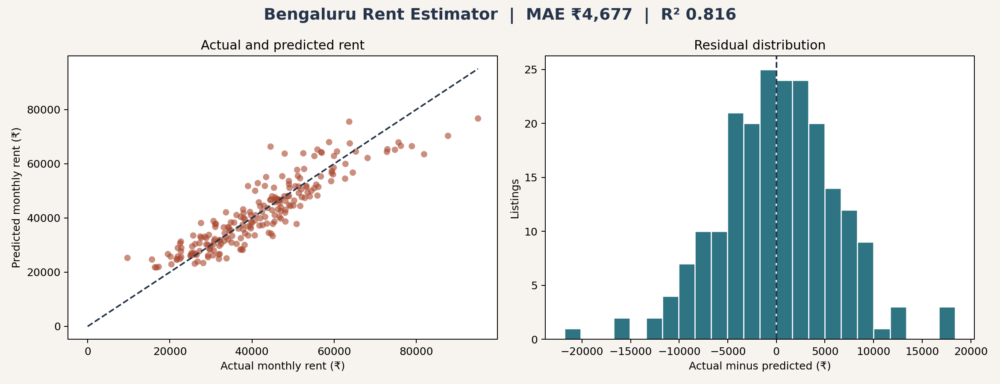

# MetroRent Price Estimator

This project estimates monthly asking rent across Bangalore, New Delhi, Mumbai, Pune, and Nagpur. It uses 21,691 raw rental listings from two MIT licensed Kaggle datasets, applies data quality rules, trains a gradient boosting model, and calibrates a practical prediction interval on a separate validation split.



## Project question

Can a rental model improve on a simple city median while remaining honest about noisy listing data and uncertainty?

## Result

| Measure | Result |
| --- | ---: |
| Raw source rows | 21,691 |
| Clean model rows | 12,201 |
| Cities | 5 |
| Localities | 2,102 |
| Held out test rows | 1,831 |
| Model MAE | ₹11,652 |
| City median baseline MAE | ₹22,122 |
| R² | 0.685 |
| 90% interval coverage | 89.7% |

The model cuts MAE by 47.3% relative to the city median baseline. Performance varies by city, so the project publishes city-level error instead of hiding every listing behind one overall score.

## Data work

The acquisition script downloads [India House Rent Prediction](https://www.kaggle.com/datasets/pranavshinde36/india-house-rent-prediction) and [New Delhi Rental Properties](https://www.kaggle.com/datasets/divyanshug40/data-for-houses-available-for-rent). Both dataset pages state an MIT licence.

The pipeline standardises fields from different schemas, removes impossible area and rent values, rejects incomplete targets, and removes exact listing signatures. The raw combined file remains separate from the model table. Source metadata and filtering counts are recorded in `data/raw/source_manifest.json`.

## Modelling approach

Categorical values use an ordinal encoder that handles unseen values. Numeric gaps use median imputation. A histogram gradient boosting regressor learns nonlinear relationships using city, locality, property type, furnishing, seller type, bedrooms, bathrooms, balconies, and area.

The split is 70% training, 15% interval calibration, and 15% final testing. The test set is not used to train the model or select the interval radius.

## Responsible use

The target is asking rent, not a signed lease value. Listings may be duplicated across platforms, stale, negotiated, or incorrectly entered. The model does not use exact address, building condition, maintenance charge, deposit, or current availability. It is an educational comparison tool, not a rental valuation service.

## Repository guide

| Path | Contents |
| --- | --- |
| `scripts/acquire_data.py` | Reproducible downloads, schema alignment, filtering, and deduplication |
| `src/train.py` | Train, calibrate, evaluate, and create visual evidence |
| `src/predict.py` | Load the saved model and return a prediction interval |
| `data/processed` | Clean model table, evaluation JSON, and source audit counts |
| `evidence` | Evaluation dashboard used in this README and report |
| `reports` | Detailed project report in PDF format |
| `tests` | Data rules and unseen-category inference checks |

[Read the ten-page project report](reports/MetroRent_Price_Estimator_Report.pdf)

## Reproduce

```bash
python3 -m venv .venv
source .venv/bin/activate
pip install -r requirements.txt
python scripts/acquire_data.py
python src/train.py
python scripts/build_report.py
pytest
ruff check src scripts tests
```

## Author

Harika
